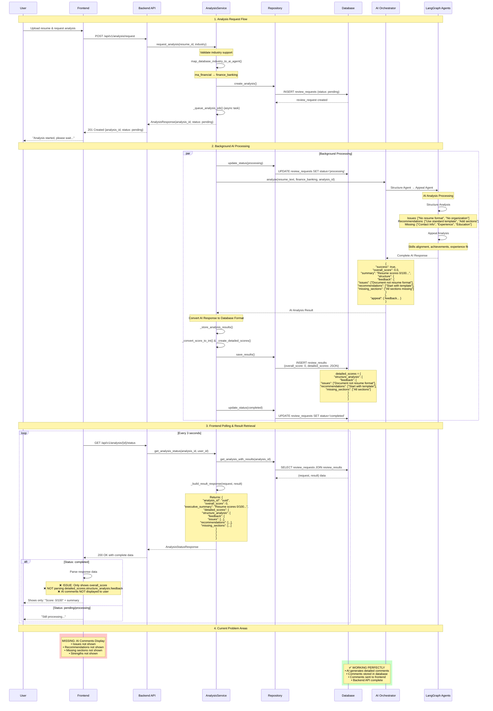

# AI Analysis Data Flow - Sequence Diagram

This document shows the complete data flow from user request to AI comments display, based on actual implementation analysis.

## Overview

The AI analysis system uses a **two-table architecture** with async background processing. AI comments are stored in database and sent to frontend, but frontend display is incomplete.

## Sequence Diagram



## Data Structure at Each Stage

### 1. AI Orchestrator Response
```json
{
  "success": true,
  "analysis_id": "uuid",
  "overall_score": 75.0,
  "market_tier": "mid",
  "summary": "Executive summary of analysis...",
  "structure": {
    "scores": {"format": 80, "organization": 75, "tone": 70, "completeness": 85},
    "feedback": {
      "issues": ["Inconsistent bullet points", "Poor section separation"],
      "recommendations": ["Add contact section", "Use consistent bullets"],
      "missing_sections": ["Contact Information", "Education section"],
      "strengths": ["Good work experience details"]
    }
  },
  "appeal": {
    "scores": {"achievement_relevance": 78, "skills_alignment": 72},
    "feedback": {
      "relevant_achievements": ["Led team of 8 developers"],
      "missing_skills": ["Cloud architecture", "DevOps"],
      "competitive_advantages": ["Strong technical leadership"],
      "improvement_areas": ["Add more quantified results"]
    }
  }
}
```

### 2. Database Storage (review_results table)
```sql
overall_score: 75
ats_score: 80
content_score: 78
formatting_score: 85
executive_summary: "Executive summary of analysis..."
detailed_scores: {
  "structure_analysis": {
    "scores": {"format": 80, "organization": 75, "tone": 70, "completeness": 85},
    "feedback": {
      "issues": ["Inconsistent bullet points", "Poor section separation"],
      "recommendations": ["Add contact section", "Use consistent bullets"],
      "missing_sections": ["Contact Information", "Education section"],
      "strengths": ["Good work experience details"]
    }
  },
  "appeal_analysis": {
    "scores": {"achievement_relevance": 78, "skills_alignment": 72},
    "feedback": {
      "relevant_achievements": ["Led team of 8 developers"],
      "missing_skills": ["Cloud architecture", "DevOps"],
      "competitive_advantages": ["Strong technical leadership"],
      "improvement_areas": ["Add more quantified results"]
    }
  },
  "market_tier": "mid",
  "ai_analysis_id": "uuid",
  "conversion_timestamp": "2025-09-28T00:44:20.894993+00:00"
}
```

### 3. Backend API Response to Frontend
```json
{
  "analysis_id": "uuid",
  "status": "completed",
  "requested_at": "2025-09-28T00:43:58.706Z",
  "completed_at": "2025-09-28T00:44:20.906Z",
  "result": {
    "analysis_id": "uuid",
    "overall_score": 75,
    "ats_score": 80,
    "content_score": 78,
    "formatting_score": 85,
    "industry": "strategy_tech",
    "executive_summary": "Executive summary of analysis...",
    "detailed_scores": {
      "structure_analysis": {
        "feedback": {
          "issues": ["Inconsistent bullet points", "Poor section separation"],
          "recommendations": ["Add contact section", "Use consistent bullets"],
          "missing_sections": ["Contact Information", "Education section"],
          "strengths": ["Good work experience details"]
        }
      },
      "appeal_analysis": {
        "feedback": {
          "relevant_achievements": ["Led team of 8 developers"],
          "missing_skills": ["Cloud architecture", "DevOps"],
          "competitive_advantages": ["Strong technical leadership"],
          "improvement_areas": ["Add more quantified results"]
        }
      }
    },
    "ai_model_used": "gpt-4",
    "processing_time_ms": 30000,
    "completed_at": "2025-09-28T00:44:20.906Z"
  }
}
```

### 4. What Frontend Currently Shows vs What's Available

#### ✅ Currently Displayed:
- Overall score (75)
- Executive summary ("Executive summary of analysis...")

#### ❌ Available But NOT Displayed:
- **Issues**: ["Inconsistent bullet points", "Poor section separation"]
- **Recommendations**: ["Add contact section", "Use consistent bullets"]
- **Missing Sections**: ["Contact Information", "Education section"]
- **Strengths**: ["Good work experience details"]
- **Missing Skills**: ["Cloud architecture", "DevOps"]
- **Competitive Advantages**: ["Strong technical leadership"]
- **Improvement Areas**: ["Add more quantified results"]
- **Relevant Achievements**: ["Led team of 8 developers"]

## Solution Required

### Backend: ✅ Complete (No changes needed)
- AI comments are generated correctly
- Data is stored in database properly
- API returns complete data including `detailed_scores`

### Frontend: ❌ Incomplete (Needs enhancement)
The frontend needs to:

1. **Parse `detailed_scores`** from the API response
2. **Extract comment arrays** from the nested JSON structure
3. **Add UI components** to display:
   - Issues section
   - Recommendations section
   - Missing sections
   - Strengths (when available)
   - Missing skills
   - Improvement areas
   - Competitive advantages

### Example Frontend Enhancement Needed:
```javascript
// Parse the detailed_scores from API response
const { detailed_scores } = analysisResult.result;
const structureFeedback = detailed_scores?.structure_analysis?.feedback || {};
const appealFeedback = detailed_scores?.appeal_analysis?.feedback || {};

// Display the AI comments
const issues = structureFeedback.issues || [];
const recommendations = structureFeedback.recommendations || [];
const missingSkills = appealFeedback.missing_skills || [];
const strengths = structureFeedback.strengths || [];
```

## Conclusion

The **AI analysis system is working perfectly**. All AI comments are generated, stored, and sent to the frontend. The only missing piece is **frontend parsing and display** of the rich feedback data that's already available in the `detailed_scores` field.