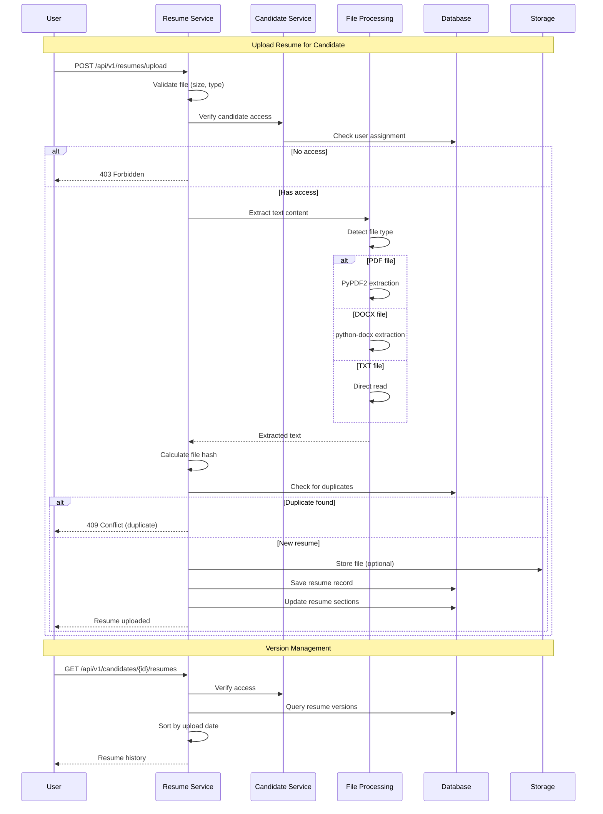
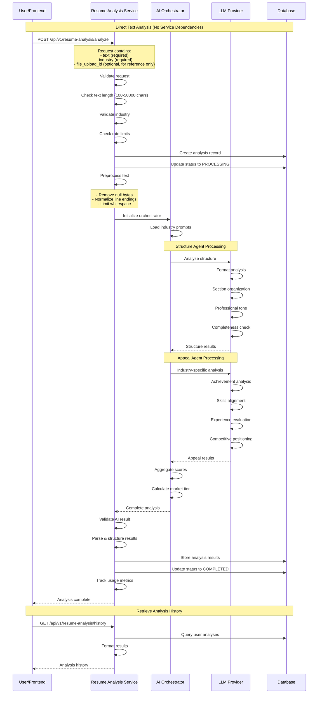
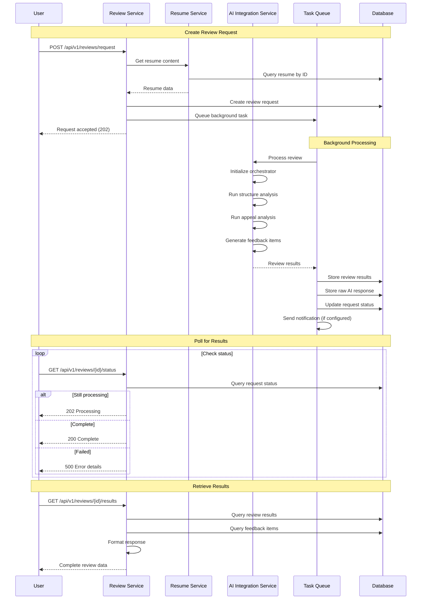
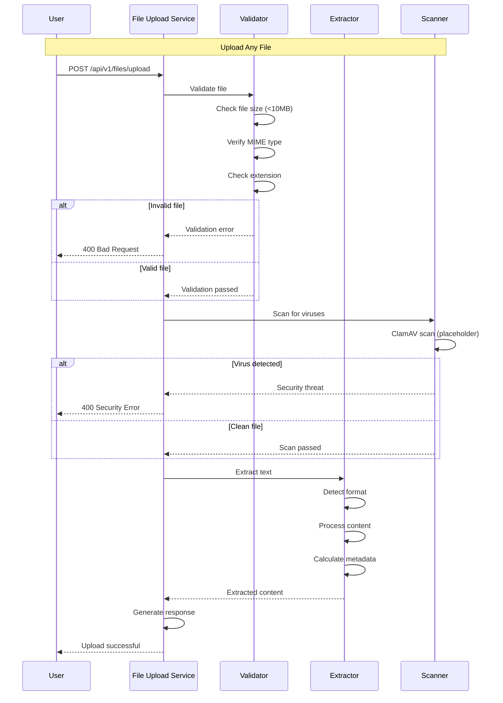
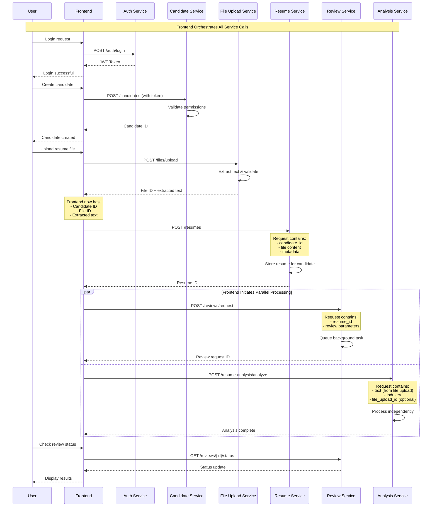
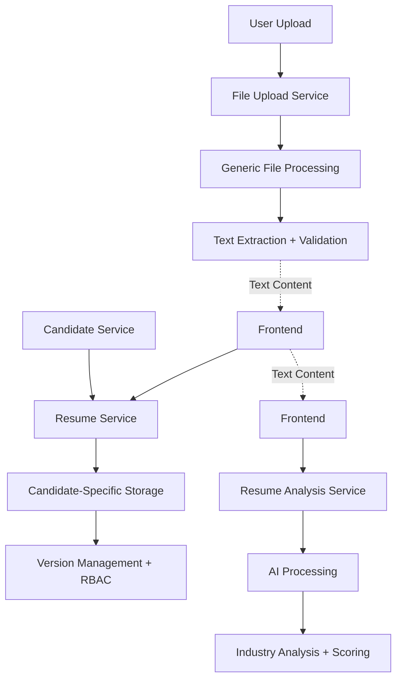

# Backend Features Integration - Sequence Diagrams v1.0

## Overview

This document provides comprehensive sequence diagrams showing the relationships and integration points between backend features in the AI Resume Review Platform. The system follows a candidate-centric architecture where all resume-related operations are tied to specific candidates.

## Table of Contents

1. [System Architecture Overview](#system-architecture-overview)
2. [Feature Dependencies](#feature-dependencies)
3. [Core User Journeys](#core-user-journeys)
4. [Integration Sequence Diagrams](#integration-sequence-diagrams)
5. [API Integration Points](#api-integration-points)

---

## System Architecture Overview

### Feature Structure

```
backend/app/features/
├── auth/           # Authentication & authorization
├── candidate/      # Candidate management (central entity)
├── file_upload/    # Generic file processing
├── resume/         # Resume management for candidates
├── resume_analysis/# AI-powered analysis
└── review/         # Comprehensive review system
```

### Architecture Principles

**Important: Service Separation of Concerns**
- Each service is **standalone** and does not directly call other services
- Services communicate only through their **public APIs** via the frontend
- The **frontend orchestrates** the workflow between services
- Services receive all required data in their **request payloads**
- This ensures loose coupling and maintains clean boundaries

### Data Flow Hierarchy

```
Frontend (Orchestrator)
    ├── Auth Service (authentication)
    ├── Candidate Service (entity management)
    ├── File Upload Service (generic file processing)
    ├── Resume Service (candidate-specific resume management)
    ├── Resume Analysis Service (AI analysis)
    └── Review Service (comprehensive review)

Note: Services do NOT call each other directly
```

### Service Purpose Clarification

**Why Three File/Resume-Related Services?**

1. **File Upload Service** - Generic file processing infrastructure
   - Reusable for any file upload needs
   - User-scoped file management
   - Comprehensive file validation and processing

2. **Resume Service** - Candidate-centric resume management
   - Links resumes to specific candidates (not users)
   - Handles resume versioning per candidate
   - Enforces candidate access control (RBAC)
   - Resume deduplication and metadata

3. **Resume Analysis Service** - AI-powered analysis
   - Industry-specific AI analysis
   - Works on text content from any source
   - Stores detailed analysis results and scores
   - Independent of file storage concerns

---

## Feature Dependencies

### Dependency Matrix

| Feature | Depends On | Used By |
|---------|-----------|---------|
| auth | None (foundational) | All features |
| candidate | auth | resume, review |
| file_upload | auth | resume_analysis |
| resume | auth, candidate | review, resume_analysis |
| resume_analysis | auth, file_upload | Frontend |
| review | auth, resume | Frontend |

### Database Relationships

```
User ←→ UserCandidateAssignment ←→ Candidate
 ↓                                      ↓
RefreshToken                        Resume
                                       ↓
                                ReviewRequest → ReviewResult
                                       ↓
                                ResumeAnalysis
```

---

## Core User Journeys

### Journey 1: Complete Resume Review Process

**Actors**: Recruitment Consultant, System Components
**Goal**: Upload and review a candidate's resume with AI analysis

### Journey 2: Multi-User Collaboration

**Actors**: Senior Recruiter, Junior Recruiters
**Goal**: Share candidate access and collaborate on reviews

### Journey 3: Batch Resume Processing

**Actors**: Admin User, System Components
**Goal**: Process multiple resumes for different candidates

---

## Integration Sequence Diagrams

### 1. Authentication & Session Management (Enhanced Detail)

```mermaid
sequenceDiagram
    participant U as User
    participant FE as Frontend
    participant A as Auth Service
    participant S as Security Module
    participant DB as Database
    participant R as Redis

    Note over U,R: Initial Login with Security Features
    U->>FE: Enter credentials
    FE->>A: POST /api/v1/auth/login
    Note over A: Request contains:<br/>- email<br/>- password<br/>- device_info (optional)
    
    A->>R: Check rate limit (5/15min)
    alt Rate limit exceeded
        A-->>FE: 429 Too Many Requests (30min lockout)
    else Within rate limit
        A->>DB: Get user by email
        alt User not found
            A->>R: Log failed attempt
            A-->>FE: 401 Invalid credentials
        else User found
            A->>DB: Check account lockout
            alt Account locked
                A-->>FE: 403 Account locked (30min)
            else Account active
                A->>S: Verify password (bcrypt 12 rounds)
                alt Invalid password
                    A->>DB: Increment failed attempts
                    alt 5th failed attempt
                        A->>DB: Lock account for 30min
                    end
                    A-->>FE: 401 Invalid credentials
                else Valid password
                    A->>DB: Reset failed attempts
                    A->>S: Generate JWT tokens
                    Note over S: Access token (30min):<br/>- user_id (sub)<br/>- email<br/>- iat, exp<br/>- unique jti
                    Note over S: Refresh token (7 days):<br/>- SHA-256 hashed<br/>- session_id<br/>- device_info<br/>- ip_address
                    A->>DB: Store refresh token
                    A->>R: Cache session (optional)
                    A-->>FE: Access + Refresh tokens
                    FE->>FE: Store in secure storage
                    FE-->>U: Login successful
                end
            end
        end
    end

    Note over U,R: Token Refresh with Rotation
    FE->>A: POST /api/v1/auth/refresh
    Note over A: Request contains:<br/>- refresh_token
    A->>DB: Validate refresh token hash
    alt Invalid/expired token
        A-->>FE: 401 Invalid refresh token
    else Valid token
        A->>S: Generate new access token
        A->>DB: Rotate refresh token (optional)
        A->>R: Blacklist old token
        A-->>FE: New access token (+ new refresh if rotated)
    end
    
    Note over U,R: Protected Endpoint Access
    FE->>A: GET /api/v1/protected (Bearer token)
    A->>S: Extract JWT from header
    A->>R: Check token blacklist
    alt Token blacklisted
        A-->>FE: 401 Token revoked
    else Token valid
        A->>S: Validate JWT signature & expiry
        alt Token expired
            A-->>FE: 401 Token expired
        else Token valid
            A->>DB: Get user by ID
            A->>A: Create user context
            A-->>FE: Authorized response with user data
        end
    end
    
    Note over U,R: Logout with Token Revocation
    U->>FE: Logout request
    FE->>A: POST /api/v1/auth/logout
    Note over A: Request contains:<br/>- access_token (header)<br/>- refresh_token (body)
    A->>R: Blacklist access token (TTL: 30min)
    A->>DB: Delete refresh token
    A->>R: Clear session cache
    A-->>FE: Logout successful
    FE->>FE: Clear stored tokens
    
    Note over U,R: Session Management
    U->>FE: View active sessions
    FE->>A: GET /api/v1/auth/sessions
    A->>DB: Query user's refresh tokens
    A->>A: Format session info
    A-->>FE: List of active sessions
    
    U->>FE: Revoke specific session
    FE->>A: DELETE /api/v1/auth/sessions/{session_id}
    A->>DB: Delete specific refresh token
    A->>R: Blacklist associated tokens
    A-->>FE: Session revoked
```



### 2. Candidate Creation & Management (Central Business Entity)

```mermaid
sequenceDiagram
    participant U as User/Frontend
    participant C as Candidate Service
    participant DB as Database

    Note over U,DB: Create New Candidate (RBAC Applied)
    U->>C: POST /api/v1/candidates
    Note over C: Request contains:<br/>- first_name, last_name<br/>- email, phone<br/>- years_experience<br/>- current_company, current_role
    
    C->>C: Extract user from JWT token
    C->>DB: Query user role
    alt User role not authorized
        C-->>U: 403 Forbidden (consultants cannot create)
    else Authorized role (admin/senior/junior recruiter)
        C->>DB: Begin transaction
        C->>DB: Create candidate record
        Note over DB: Sets created_by_user_id
        C->>DB: Create UserCandidateAssignment
        Note over DB: assignment_type = 'primary'<br/>is_active = true<br/>assigned_by = creator
        C->>DB: Commit transaction
        C-->>U: Candidate created with ID
    end

    Note over U,DB: List Candidates (Role-Based Access)
    U->>C: GET /api/v1/candidates?page=1&page_size=10
    C->>C: Extract user from JWT
    C->>DB: Query user role
    
    alt Admin or Senior Recruiter
        C->>DB: Query ALL candidates (no filter)
    else Junior Recruiter
        C->>DB: Query via UserCandidateAssignment
        Note over DB: WHERE user_id = current_user<br/>AND is_active = true
    else Consultant
        C-->>U: 403 Forbidden
    end
    
    C->>C: Process candidates list
    Note over C: TODO: Add resume stats<br/>TODO: Get actual count for pagination
    C-->>U: CandidateListResponse

    Note over U,DB: Get Specific Candidate
    U->>C: GET /api/v1/candidates/{candidate_id}
    C->>C: Check access permissions
    C->>DB: Query user role
    
    alt Admin/Senior Recruiter
        C->>DB: Direct candidate query
    else Junior Recruiter
        C->>DB: Check UserCandidateAssignment
        alt No active assignment
            C-->>U: 404 Not Found
        else Has assignment
            C->>DB: Query candidate
        end
    end
    
    C->>C: Prepare CandidateWithStats
    Note over C: Includes placeholder stats:<br/>- total_resumes = 0<br/>- latest_resume_version = 0
    C-->>U: Candidate details

    Note over U,DB: Update Candidate Information
    U->>C: PUT /api/v1/candidates/{candidate_id}
    C->>C: Validate access (same RBAC logic)
    alt No access
        C-->>U: 404 Not Found
    else Has access
        C->>DB: Update candidate fields
        C->>DB: Set updated_at = utc_now()
        C-->>U: Updated candidate
    end

    Note over U,DB: Share Candidate (Assignment Management)
    U->>C: POST /api/v1/candidates/{id}/assignments
    Note over C: Request contains:<br/>- user_id (assignee)<br/>- assignment_type (secondary/viewer)
    
    C->>C: Check requester permissions
    C->>DB: Query existing assignments
    
    alt Not primary assignee & not admin
        C-->>U: 403 Forbidden
    else Can assign
        C->>DB: Check if assignment exists
        alt Assignment exists
            C->>DB: Reactivate if inactive
        else New assignment
            C->>DB: Create UserCandidateAssignment
            Note over DB: assigned_by = requester<br/>assignment_type = secondary/viewer
        end
        C-->>U: Assignment created
    end

    Note over U,DB: Remove Assignment
    U->>C: DELETE /api/v1/candidates/{id}/assignments/{user_id}
    C->>C: Check permissions (primary or admin)
    alt Cannot unassign
        C-->>U: 403 Forbidden
    else Can unassign
        C->>DB: Update assignment
        Note over DB: is_active = false<br/>unassigned_at = utc_now()<br/>unassigned_reason = provided
        C-->>U: Assignment removed
    end
```



### 3. Resume Upload & Processing



### 4. AI-Powered Resume Analysis (Standalone Service)



### 5. Comprehensive Review System



### 6. File Upload Pipeline (Generic)



### 7. Frontend-Orchestrated Integration Flow (Proper Separation of Concerns)



---

## API Integration Points

### Required Headers

All authenticated endpoints require:
```
Authorization: Bearer <access_token>
Content-Type: application/json
```

### Error Response Format

```json
{
  "detail": "Error message",
  "status_code": 400,
  "error_type": "validation_error"
}
```

### Common Status Codes

| Code | Meaning | Usage |
|------|---------|-------|
| 200 | Success | Successful GET/PUT |
| 201 | Created | Successful POST |
| 202 | Accepted | Async processing started |
| 400 | Bad Request | Validation error |
| 401 | Unauthorized | Invalid/missing token |
| 403 | Forbidden | Insufficient permissions |
| 404 | Not Found | Resource doesn't exist |
| 409 | Conflict | Duplicate resource |
| 429 | Too Many Requests | Rate limit exceeded |
| 500 | Internal Error | Server error |

### Integration Checklist

- [ ] Auth service integrated with all features
- [ ] Candidate service provides central entity management
- [ ] Resume service linked to candidates
- [ ] Review service uses background processing
- [ ] Analysis service uses AI orchestrator
- [ ] File upload provides generic processing
- [ ] All services handle errors consistently
- [ ] Rate limiting applied to sensitive endpoints
- [ ] Audit logging for all operations
- [ ] Metrics collection for monitoring

---

## Resume Service vs File Upload vs Resume Analysis

### Service Relationship & Workflow

The three services work together but serve different purposes:



### Typical User Journey

1. **Upload File**: `Frontend → File Upload Service`
   - Extract text from PDF/DOCX
   - Validate file security
   - Return file ID + extracted text

2. **Store Resume**: `Frontend → Resume Service`
   - Link to specific candidate
   - Store with version control
   - Apply candidate access control
   - Check for duplicates

3. **Analyze Resume**: `Frontend → Resume Analysis Service`
   - Send extracted text for AI analysis
   - Get industry-specific feedback
   - Store analysis results

### Redundancy Issues Found

⚠️ **Code Duplication**: Both File Upload and Resume services have identical text extraction methods. This should be refactored into shared utilities:

```python
# Recommended: app/core/text_extraction.py
class TextExtractor:
    @staticmethod
    def extract_pdf_text(content: bytes) -> str: ...
    @staticmethod  
    def extract_docx_text(content: bytes) -> str: ...
```

### Integration Notes

- **File Upload**: User-scoped, generic file handling
- **Resume**: Candidate-scoped, business-specific management
- **Resume Analysis**: Content-focused, AI processing

Only the **Resume Service** is properly integrated with the candidate-centric architecture and RBAC system.

---

## Candidate Service Implementation Notes

### Candidate-Centric Architecture

The candidate service serves as the **central business entity** in the system:
- All resumes belong to candidates (not users)
- Reviews are performed on candidate resumes
- Users access candidates through assignments

### Role-Based Access Control (RBAC)

**User Roles & Permissions:**
- **Admin**: Full access to all candidates
- **Senior Recruiter**: Full access to all candidates
- **Junior Recruiter**: Access only to assigned candidates
- **Consultant**: No candidate access (read-only via specific endpoints)

### Assignment System

**Assignment Types:**
- **Primary**: Main recruiter responsible for candidate
- **Secondary**: Supporting recruiter with full access
- **Viewer**: Read-only access for oversight

**Assignment Features:**
- Full audit trail (who assigned, when, why unassigned)
- Soft delete with reactivation capability
- Assignment history preservation

### Known Issues to Address

1. **Missing Repository Pattern**: Service directly uses ORM instead of repository layer (inconsistent with other services)
2. **Incomplete Statistics**: TODO comments for resume stats and counts
3. **N+1 Query Problem**: Each candidate access check hits database separately
4. **Missing Indexes**: Need composite indexes on assignment table for performance

### Integration Notes

Other services check candidate access using similar RBAC logic:
```python
# Resume service validates candidate access before operations
if user.role in ['admin', 'senior_recruiter']:
    return True  # Global access
# Check assignments for junior recruiters
```

---

## Auth Service Implementation Notes

### Security Features Implemented

1. **Password Security**:
   - Bcrypt with 12 rounds
   - Strong password policy (8+ chars, upper/lower/digit/special)
   - Common password blacklist
   - Account lockout after 5 failed attempts (30min)

2. **Rate Limiting** (Redis-based):
   - Login: 5 attempts/15min → 30min block
   - Registration: 3 attempts/hour → 1hr block  
   - Password reset: 3 attempts/hour → 30min block
   - General API: 100 requests/hour → 5min block

3. **Token Security**:
   - JWT with unique IDs (jti) to prevent replay
   - Token blacklisting on logout
   - Refresh token rotation support
   - SHA-256 hashing for stored refresh tokens

4. **Session Management**:
   - Multiple concurrent sessions
   - Device & IP tracking
   - Individual session revocation
   - Bulk revocation on password change

### Known Issues to Address

1. **Missing `get_current_user` Implementation**: The dependency used by other services needs proper implementation to return User objects
2. **Logout Endpoint**: Refresh token should be in request body, not directly on request object
3. **Error Response Consistency**: Some endpoints return different error formats

### Integration Pattern for Other Services

```python
from app.features.auth.api import get_current_user
from database.models.auth import User

@router.get("/protected")
async def protected_endpoint(
    current_user: User = Depends(get_current_user)
):
    # Access authenticated user
    return {"user_id": current_user.id}
```

---

## Version History

| Version | Date | Author | Changes |
|---------|------|--------|---------|
| 1.0 | 2025-01-11 | Backend Team | Initial documentation with complete sequence diagrams |
| 1.1 | 2025-01-11 | Backend Team | Added detailed auth service documentation and corrected service separation |

---

## Next Steps

1. **Complete Router Integration**: Add missing feature routers to main.py
2. **Integration Testing**: Create end-to-end tests for complete workflows
3. **Performance Optimization**: Add caching for frequently accessed data
4. **Event System**: Implement domain events for loose coupling
5. **API Gateway**: Consider adding gateway for frontend communication

---

## Notes

- All datetime operations use `app.core.datetime_utils.utc_now()`
- File processing is in-memory only (no persistent storage)
- AI orchestrator is shared between review and analysis features
- Background tasks use Redis for queue management
- JWT tokens: access (30min), refresh (7 days)
- Rate limiting: 5 login attempts per 15 minutes