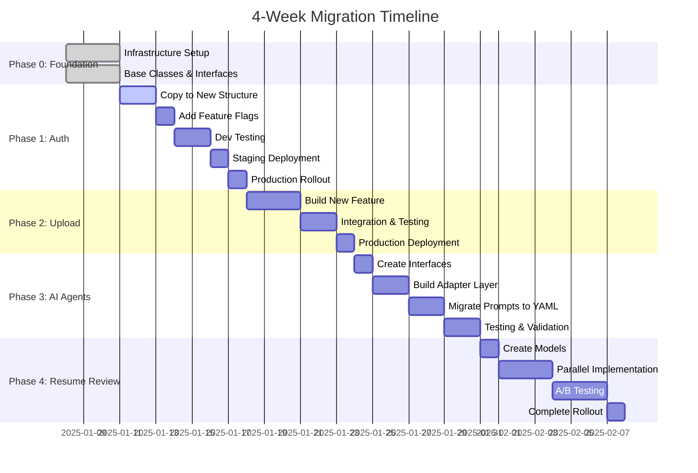

# Backend Architecture Migration Plan

## Executive Summary

This document outlines a **zero-downtime, low-risk migration strategy** for transitioning our backend from the current technical-layer architecture to a feature-based architecture. The migration will take approximately 4 weeks using the "Strangler Fig Pattern" - building new alongside old with gradual cutover.

### Key Principles

1. **Zero Downtime** - Production never breaks
2. **Incremental Migration** - One feature at a time
3. **Instant Rollback** - Feature flags enable immediate reversion
4. **Continuous Validation** - Test at every step
5. **Parallel Running** - Old and new code coexist during transition

## Migration Timeline



## Phase 0: Foundation Setup (Days 1-3)

### Objective
Establish the new architecture foundation without touching existing code.

### Directory Structure to Create
```bash
backend/
├── app/
│   ├── infrastructure/           # NEW - External service abstractions
│   │   ├── persistence/
│   │   │   ├── postgres/
│   │   │   │   ├── __init__.py
│   │   │   │   ├── connection.py
│   │   │   │   └── base.py
│   │   │   └── redis/
│   │   │       ├── __init__.py
│   │   │       ├── connection.py
│   │   │       └── cache.py
│   │   └── storage/
│   │       ├── __init__.py
│   │       ├── interface.py
│   │       └── providers/
│   │
│   ├── features/                # NEW - Feature modules
│   │   └── __init__.py
│   │
│   └── ai_agents/              # NEW - AI abstraction
│       ├── __init__.py
│       └── interface.py
```

### Implementation Tasks

#### Task 1: Create Base Repository Class
```python
# app/infrastructure/persistence/postgres/base.py
from typing import Generic, TypeVar, Optional
from sqlalchemy.ext.asyncio import AsyncSession
from uuid import UUID

T = TypeVar('T')

class BaseRepository(Generic[T]):
    """Base repository with common CRUD operations"""
    
    def __init__(self, session: AsyncSession, model_class: type[T]):
        self.session = session
        self.model_class = model_class
    
    async def get_by_id(self, id: UUID) -> Optional[T]:
        """Get entity by ID"""
        # Implementation
    
    async def create(self, **kwargs) -> T:
        """Create new entity"""
        # Implementation
```

#### Task 2: Create AI Interface
```python
# app/ai_agents/interface.py
from typing import Protocol
from pydantic import BaseModel

class AIAnalyzer(Protocol):
    """Interface for AI analysis services"""
    async def analyze_resume(self, request: AnalysisRequest) -> AnalysisResult:
        ...
```

### Validation Checklist
- [ ] New directories created
- [ ] Base classes implemented
- [ ] Interfaces defined
- [ ] No existing code modified
- [ ] All existing tests still pass

### Rollback Plan
Simply delete the new directories - no existing code affected.

## Phase 1: Auth Migration - Proof of Concept (Days 4-7)

### Objective
Migrate authentication as the first feature to validate the migration pattern.

### Why Auth First?
- Complete and working (98.7% test coverage)
- Critical functionality (easy to verify)
- Good size for learning the pattern
- Already well-tested

### Step-by-Step Migration

#### Step 1: Copy (Don't Move) Auth Code
```bash
# Copy existing files to new structure
cp app/api/auth.py app/features/auth/api.py
cp app/models/user.py app/features/auth/models.py
cp app/models/session.py app/features/auth/models.py

# Extract service layer from API
# Create app/features/auth/service.py
# Create app/features/auth/repository.py
```

#### Step 2: Add Feature Flag
```python
# app/core/config.py
class Settings(BaseSettings):
    USE_NEW_AUTH: bool = Field(default=False, env="USE_NEW_AUTH")

# app/main.py
if settings.USE_NEW_AUTH:
    from app.features.auth.api import router as auth_router
    logger.info("Using NEW auth implementation")
else:
    from app.api.auth import router as auth_router
    logger.info("Using OLD auth implementation")

app.include_router(auth_router, prefix="/api/auth", tags=["auth"])
```

#### Step 3: Parallel Testing
```bash
# Test old implementation
USE_NEW_AUTH=false pytest app/api/auth.py -v

# Test new implementation
USE_NEW_AUTH=true pytest app/features/auth/tests/ -v

# Performance comparison
python scripts/benchmark_auth.py --compare
```

### Rollout Schedule

| Day | Environment | Action | Rollback Time |
|-----|------------|--------|---------------|
| Day 4 | Development | Enable new auth | < 1 minute |
| Day 5 | Staging | 100% traffic to new | < 1 minute |
| Day 6 | Production | 10% traffic to new | < 1 minute |
| Day 7 | Production | 100% traffic to new | < 1 minute |
| Day 10 | All | Remove old code | N/A |

### Success Criteria
- [ ] All auth endpoints return identical responses
- [ ] Response time within 10% of original
- [ ] All tests pass (unit, integration, e2e)
- [ ] No new error types in logs
- [ ] 72 hours in production without issues

### Monitoring Dashboard
```python
# scripts/monitor_migration.py
class MigrationMonitor:
    def check_auth_migration(self):
        return {
            "old_auth_requests": prometheus.query("requests{handler='old_auth'}"),
            "new_auth_requests": prometheus.query("requests{handler='new_auth'}"),
            "old_auth_errors": prometheus.query("errors{handler='old_auth'}"),
            "new_auth_errors": prometheus.query("errors{handler='new_auth'}"),
            "old_auth_p95": prometheus.query("latency{handler='old_auth',quantile='0.95'}"),
            "new_auth_p95": prometheus.query("latency{handler='new_auth',quantile='0.95'}"),
        }
```

### Rollback Procedure
```bash
# Instant rollback via environment variable
export USE_NEW_AUTH=false
kubectl rollout restart deployment/backend

# Verification
curl -X POST https://api.example.com/api/auth/login
# Should use old implementation immediately
```

## Phase 2: Upload Feature Implementation (Days 8-10)

### Objective
Implement the missing upload feature directly in the new structure.

### Implementation Plan

#### Step 1: Create Feature Structure
```bash
app/features/upload/
├── __init__.py
├── api.py           # Upload endpoints
├── models.py        # SQLAlchemy models
├── schemas.py       # Pydantic schemas
├── service.py       # Business logic
├── repository.py    # Data access
└── tests/
    ├── unit/
    ├── integration/
    └── fixtures/
```

#### Step 2: Implement Models
```python
# app/features/upload/models.py
class AnalysisRequest(Base):
    __tablename__ = "analysis_requests"
    id = Column(UUID, primary_key=True)
    user_id = Column(UUID, ForeignKey("users.id"))
    original_filename = Column(String(255))
    file_path = Column(String(500))
    status = Column(String(50))
    # ... match existing schema
```

#### Step 3: Create API Endpoints
```python
# app/features/upload/api.py
router = APIRouter()

@router.post("/upload")
async def upload_resume(
    file: UploadFile,
    current_user: User = Depends(get_current_user),
    service: UploadService = Depends(get_upload_service)
):
    return await service.process_upload(file, current_user.id)
```

### Success Criteria
- [ ] File upload works end-to-end
- [ ] Text extraction functioning
- [ ] Storage abstraction working
- [ ] 80% test coverage achieved
- [ ] API documentation updated

## Phase 3: AI Agents Isolation (Days 11-14)

### Objective
Decouple AI functionality from business logic using adapter pattern.

### Migration Strategy

#### Step 1: Create Adapter Layer
```python
# app/ai_agents/adapter.py
class LegacyAIAdapter:
    """Adapts old AI implementation to new interface"""
    
    def __init__(self):
        from app.ai.orchestrator import ResumeAnalysisOrchestrator
        self.legacy_orchestrator = ResumeAnalysisOrchestrator()
    
    async def analyze_resume(self, request: AnalysisRequest) -> AnalysisResult:
        # Translate new interface to old implementation
        legacy_result = await self.legacy_orchestrator.analyze(
            resume_text=request.text,
            industry=request.industry
        )
        
        # Transform to new format
        return AnalysisResult(
            overall_score=legacy_result['score'],
            strengths=legacy_result['strengths'],
            weaknesses=legacy_result['weaknesses']
        )
```

#### Step 2: Migrate Prompts to YAML
```yaml
# app/ai_agents/prompts/templates/resume/structure_v1.yaml
metadata:
  name: structure_analysis
  version: 1.0.0
  model: gpt-4

prompts:
  system: |
    You are an expert resume analyst.
    Focus on structure and formatting.
  
  user: |
    Analyze this resume:
    {resume_text}
```

#### Step 3: Gradual Implementation
```python
# Feature flag for AI migration
USE_NEW_AI_STRUCTURE = False  # Start with adapter
USE_NEW_AI_APPEAL = False     # Migrate one agent at a time
```

### Success Criteria
- [ ] AI functionality unchanged from user perspective
- [ ] All prompts migrated to YAML
- [ ] Provider abstraction working
- [ ] Performance within 5% of original

## Phase 4: Resume Review Migration (Days 15-18)

### Objective
Migrate the core resume review functionality with A/B testing.

### A/B Testing Strategy

```python
# app/features/resume_review/ab_test.py
class ABTestManager:
    def __init__(self):
        self.rollout_percentage = {
            "development": 100,
            "staging": 100,
            "production": 10  # Start with 10%
        }
    
    def should_use_new_implementation(self, user_id: str) -> bool:
        environment = os.getenv("ENVIRONMENT", "development")
        percentage = self.rollout_percentage[environment]
        
        # Consistent hashing for user stickiness
        user_hash = hashlib.md5(user_id.encode()).hexdigest()
        user_bucket = int(user_hash[:8], 16) % 100
        
        return user_bucket < percentage
```

### Traffic Rollout Schedule

| Day | Production Traffic | Validation Period | Next Step Criteria |
|-----|-------------------|-------------------|-------------------|
| Day 15 | 10% | 24 hours | Error rate < 0.1% |
| Day 16 | 25% | 24 hours | P95 latency < 200ms |
| Day 17 | 50% | 24 hours | No user complaints |
| Day 18 | 100% | 72 hours | All metrics stable |

## Validation & Monitoring

### Automated Validation Script
```bash
#!/bin/bash
# scripts/validate_migration.sh

echo "🔍 Validating Migration Status..."

# Check feature flags
echo "Feature Flags:"
echo "  USE_NEW_AUTH: $USE_NEW_AUTH"
echo "  USE_NEW_UPLOAD: $USE_NEW_UPLOAD"
echo "  USE_NEW_AI: $USE_NEW_AI"

# Run tests
echo -e "\n📝 Running Tests..."
pytest -m unit --tb=short
pytest -m integration --tb=short
pytest -m contract --tb=short

# Check performance
echo -e "\n⚡ Performance Check..."
python scripts/benchmark_all.py --compare

# API contract validation
echo -e "\n📋 API Contract Validation..."
python scripts/validate_api_contracts.py

# Database schema check
echo -e "\n🗄️ Database Schema Check..."
python scripts/validate_db_schema.py

echo -e "\n✅ Migration Validation Complete!"
```

### Key Metrics Dashboard

```python
# scripts/migration_dashboard.py
import prometheus_client
import psycopg2
import redis

class MigrationDashboard:
    def get_metrics(self):
        return {
            "api_metrics": {
                "requests_per_second": self.get_rps(),
                "error_rate": self.get_error_rate(),
                "p95_latency": self.get_p95_latency(),
            },
            "database_metrics": {
                "connection_pool_usage": self.get_db_pool_usage(),
                "slow_queries": self.get_slow_queries(),
            },
            "feature_adoption": {
                "new_auth_percentage": self.get_feature_usage("auth"),
                "new_upload_percentage": self.get_feature_usage("upload"),
                "new_ai_percentage": self.get_feature_usage("ai"),
            },
            "health_checks": {
                "all_tests_passing": self.run_health_checks(),
                "no_memory_leaks": self.check_memory(),
                "no_connection_leaks": self.check_connections(),
            }
        }
```

## Rollback Procedures

### Level 1: Feature Flag Rollback (< 1 minute)
```bash
# Immediate rollback via environment variables
export USE_NEW_AUTH=false
export USE_NEW_UPLOAD=false
export USE_NEW_AI=false

# Apply to Kubernetes
kubectl create configmap backend-config --from-env-file=.env -o yaml --dry-run=client | kubectl apply -f -
kubectl rollout restart deployment/backend
```

### Level 2: Code Rollback (< 5 minutes)
```bash
# Revert to previous git commit
git revert HEAD
git push origin main

# Trigger CI/CD pipeline
gh workflow run deploy.yml
```

### Level 3: Database Rollback (< 10 minutes)
```sql
-- All migrations are backwards compatible
-- But if needed, rollback migrations:
alembic downgrade -1
```

## Risk Matrix

| Risk | Probability | Impact | Mitigation | Detection |
|------|------------|--------|------------|-----------|
| Hidden dependencies | Medium | High | Parallel running | Integration tests |
| Performance degradation | Low | Medium | Benchmarking | APM monitoring |
| Data inconsistency | Low | High | Same DB tables | Data validation |
| API contract break | Low | High | Contract tests | Client monitoring |
| Memory leaks | Low | Medium | Profiling | Memory monitoring |

## Team Responsibilities

### Migration Team Structure

| Role | Responsibilities | Team Member |
|------|-----------------|-------------|
| **Migration Lead** | Overall coordination, risk management | TBD |
| **Infrastructure Engineer** | Base classes, persistence layer | TBD |
| **Feature Engineer 1** | Auth & Upload migration | TBD |
| **Feature Engineer 2** | Resume Review migration | TBD |
| **AI Engineer** | AI agents isolation | TBD |
| **QA Engineer** | Test migration, validation scripts | TBD |
| **DevOps Engineer** | CI/CD, monitoring, rollback procedures | TBD |

### Daily Standup Questions

1. What feature/component did you migrate yesterday?
2. What are you migrating today?
3. Are there any blockers or unexpected dependencies?
4. Have all tests passed for your changes?
5. What's the rollback plan for your changes?

## Communication Plan

### Stakeholder Updates

| Milestone | Communication | Audience |
|-----------|--------------|----------|
| Phase 0 Complete | "Foundation ready, no production impact" | Tech Lead |
| Phase 1 Complete | "Auth migrated successfully, X% performance improvement" | Product Manager |
| Phase 2 Complete | "Upload feature launched in new architecture" | All Stakeholders |
| Phase 3 Complete | "AI fully isolated, ready for prompt improvements" | AI Team |
| Phase 4 Complete | "Migration complete, all features on new architecture" | Executive Team |

### Incident Response

```python
# Escalation Path
if error_rate > 1%:
    notify_on_call_engineer()
    
if error_rate > 5%:
    notify_team_lead()
    automatic_rollback()
    
if error_rate > 10%:
    notify_all_stakeholders()
    emergency_meeting()
```

## Post-Migration Cleanup

### Week 5: Cleanup Tasks

- [ ] Remove all old code
- [ ] Remove feature flags
- [ ] Archive migration scripts
- [ ] Update all documentation
- [ ] Conduct retrospective
- [ ] Knowledge transfer session

### Final Validation

- [ ] All features on new architecture
- [ ] Performance improved or same
- [ ] Test coverage > 80%
- [ ] No tech debt introduced
- [ ] Documentation complete
- [ ] Team trained on new structure

## Appendix A: Commands Reference

### Development Commands
```bash
# Run specific feature tests
pytest app/features/auth/tests/ -v

# Check feature flag status
python -c "from app.core.config import settings; print(settings.USE_NEW_AUTH)"

# Benchmark comparison
python scripts/benchmark_auth.py --old --new --compare

# Validate migration status
./scripts/validate_migration.sh
```

### Deployment Commands
```bash
# Deploy with feature flag
USE_NEW_AUTH=true kubectl apply -f k8s/backend.yaml

# Monitor rollout
kubectl rollout status deployment/backend

# Check logs
kubectl logs -f deployment/backend --tail=100

# Rollback deployment
kubectl rollout undo deployment/backend
```

## Appendix B: Migration Checklist Template

### Per-Feature Migration Checklist

- [ ] **Planning**
  - [ ] Identify all dependencies
  - [ ] Review existing tests
  - [ ] Plan rollback strategy

- [ ] **Implementation**
  - [ ] Create feature directory structure
  - [ ] Copy/adapt existing code
  - [ ] Extract service layer
  - [ ] Implement repository pattern
  - [ ] Add feature flag

- [ ] **Testing**
  - [ ] Unit tests pass
  - [ ] Integration tests pass
  - [ ] Performance benchmarks acceptable
  - [ ] API contracts unchanged

- [ ] **Deployment**
  - [ ] Deploy to development
  - [ ] Deploy to staging
  - [ ] Gradual production rollout
  - [ ] Monitor metrics

- [ ] **Validation**
  - [ ] 24 hours stable in production
  - [ ] No increase in errors
  - [ ] Performance acceptable
  - [ ] No user complaints

- [ ] **Cleanup**
  - [ ] Remove old code
  - [ ] Remove feature flag
  - [ ] Update documentation

## Appendix C: Emergency Contacts

| Role | Name | Contact | When to Contact |
|------|------|---------|-----------------|
| Migration Lead | TBD | TBD | Any migration issues |
| DevOps On-Call | TBD | TBD | Production issues |
| Database Admin | TBD | TBD | Data inconsistencies |
| Product Owner | TBD | TBD | User-facing issues |

---

**Document Version**: 1.0.0  
**Last Updated**: 2025-01-07  
**Status**: Ready for Review  
**Next Review**: After Phase 1 Completion

## Questions?

For questions or clarifications about this migration plan, please contact the Migration Lead or raise an issue in the project repository.