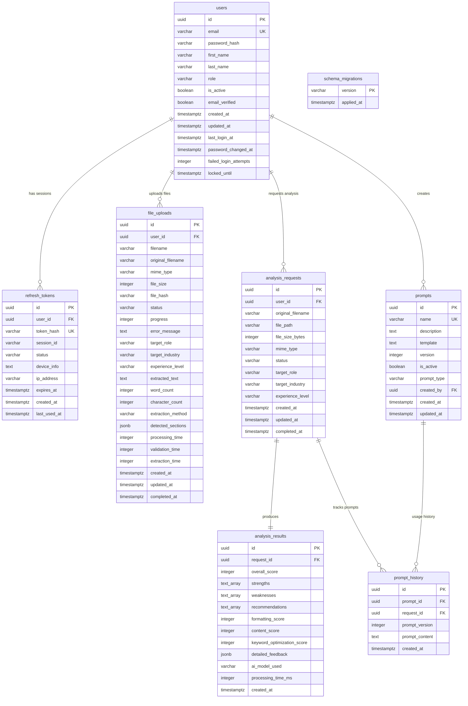

# Database Schema Reference v1.0

**Database**: `ai_resume_review_dev`  
**PostgreSQL Version**: 15  
**Last Updated**: September 9, 2025  
**Total Tables**: 8 | **Total Columns**: 92

## Quick Reference

| Table | Primary Purpose | Rows | Key Features |
|-------|----------------|------|--------------|
| `users` | Authentication & profiles | Active | Security features, role-based access |
| `refresh_tokens` | JWT session management | Active | Multi-device, token hashing |
| `file_uploads` | File processing workflow | 1 | 24 columns, complete pipeline |
| `analysis_requests` | AI analysis job tracking | 3 | Job lifecycle management |
| `analysis_results` | AI analysis output | Linked | Structured scores & feedback |
| `prompts` | AI prompt templates | Templates | Versioning & categorization |
| `prompt_history` | Prompt audit trail | Audit | Complete usage tracking |
| `schema_migrations` | Migration tracking | History | Version control |

## Database Schema Diagram



## Core Relationships

```sql
users (1) ←→ (many) refresh_tokens
users (1) ←→ (many) file_uploads  
users (1) ←→ (many) analysis_requests
analysis_requests (1) ←→ (1) analysis_results
prompts (1) ←→ (many) prompt_history
analysis_requests (1) ←→ (many) prompt_history
```

## Table Specifications

### users
**Purpose**: User accounts with security features  
**Table Name**: `users`

| Column | Type | Nullable | Default | Constraints |
|--------|------|----------|---------|-------------|
| `id` | uuid | NO | uuid_generate_v4() | PK |
| `email` | varchar(255) | NO | - | UNIQUE |
| `password_hash` | varchar(255) | NO | - | - |
| `first_name` | varchar(100) | NO | - | - |
| `last_name` | varchar(100) | NO | - | - |
| `role` | varchar(50) | NO | 'consultant' | CHECK (consultant, admin) |
| `is_active` | boolean | NO | true | - |
| `email_verified` | boolean | NO | false | - |
| `created_at` | timestamptz | NO | now() | - |
| `updated_at` | timestamptz | NO | now() | - |
| `last_login_at` | timestamptz | YES | - | - |
| `password_changed_at` | timestamptz | NO | now() | - |
| `failed_login_attempts` | integer | YES | 0 | - |
| `locked_until` | timestamptz | YES | - | - |

**Indexes**: `users_pkey`, `idx_users_email`, `idx_users_failed_attempts`, `idx_users_locked_until`, `users_email_key`

### refresh_tokens
**Purpose**: JWT session management  
**Table Name**: `refresh_tokens`

| Column | Type | Nullable | Default | Constraints |
|--------|------|----------|---------|-------------|
| `id` | uuid | NO | gen_random_uuid() | PK |
| `user_id` | uuid | NO | - | FK users(id) CASCADE |
| `token_hash` | varchar(255) | NO | - | UNIQUE |
| `session_id` | varchar(255) | NO | - | - |
| `status` | varchar(50) | NO | 'active' | CHECK (active, expired, revoked) |
| `device_info` | text | YES | - | - |
| `ip_address` | varchar(45) | YES | - | - |
| `expires_at` | timestamptz | NO | - | - |
| `created_at` | timestamptz | NO | CURRENT_TIMESTAMP | - |
| `last_used_at` | timestamptz | NO | CURRENT_TIMESTAMP | - |

**Indexes**: `refresh_tokens_pkey`, `idx_refresh_tokens_expires_at`, `idx_refresh_tokens_session_id`, `idx_refresh_tokens_status`, `idx_refresh_tokens_token_hash`, `idx_refresh_tokens_user_id`, `idx_refresh_tokens_user_session`, `idx_refresh_tokens_user_status`, `refresh_tokens_token_hash_key`

### file_uploads ⭐ **COMPREHENSIVE**
**Purpose**: Complete file processing workflow  
**Table Name**: `file_uploads`

| Column | Type | Nullable | Default | Constraints |
|--------|------|----------|---------|-------------|
| `id` | uuid | NO | gen_random_uuid() | PK |
| `user_id` | uuid | NO | - | FK users(id) CASCADE |
| `filename` | varchar(255) | NO | - | - |
| `original_filename` | varchar(255) | NO | - | - |
| `mime_type` | varchar(100) | NO | - | - |
| `file_size` | integer | NO | - | CHECK > 0 |
| `file_hash` | varchar(64) | NO | - | - |
| `status` | varchar(20) | NO | 'pending' | CHECK (pending, validating, extracting, completed, error) |
| `progress` | integer | YES | 0 | CHECK 0-100 |
| `error_message` | text | YES | - | - |
| `target_role` | varchar(255) | YES | - | - |
| `target_industry` | varchar(255) | YES | - | - |
| `experience_level` | varchar(20) | YES | - | CHECK (junior, mid, senior) |
| `extracted_text` | text | YES | - | - |
| `word_count` | integer | YES | - | - |
| `character_count` | integer | YES | - | - |
| `extraction_method` | varchar(50) | YES | - | - |
| `detected_sections` | jsonb | YES | - | - |
| `processing_time` | integer | YES | - | - |
| `validation_time` | integer | YES | - | - |
| `extraction_time` | integer | YES | - | - |
| `created_at` | timestamptz | NO | CURRENT_TIMESTAMP | - |
| `updated_at` | timestamptz | NO | CURRENT_TIMESTAMP | - |
| `completed_at` | timestamptz | YES | - | - |

**Status Flow**: `pending` → `validating` → `extracting` → `completed`/`error`  
**Indexes**: `file_uploads_pkey`, `idx_file_uploads_created_at`, `idx_file_uploads_file_hash`, `idx_file_uploads_status`, `idx_file_uploads_user_id_created_at`, `idx_file_uploads_user_status`

### analysis_requests
**Purpose**: AI analysis job tracking  
**Table Name**: `analysis_requests`

| Column | Type | Nullable | Default | Constraints |
|--------|------|----------|---------|-------------|
| `id` | uuid | NO | uuid_generate_v4() | PK |
| `user_id` | uuid | NO | - | FK users(id) CASCADE |
| `original_filename` | varchar(255) | NO | - | - |
| `file_path` | varchar(500) | NO | - | - |
| `file_size_bytes` | integer | NO | - | - |
| `mime_type` | varchar(100) | NO | - | - |
| `status` | varchar(50) | NO | 'pending' | CHECK (pending, processing, completed, failed) |
| `target_role` | varchar(255) | YES | - | - |
| `target_industry` | varchar(255) | YES | - | - |
| `experience_level` | varchar(50) | YES | - | CHECK (entry, mid, senior, executive) |
| `created_at` | timestamptz | NO | now() | - |
| `updated_at` | timestamptz | NO | now() | - |
| `completed_at` | timestamptz | YES | - | - |

**Indexes**: `analysis_requests_pkey`, `idx_analysis_requests_created_at`, `idx_analysis_requests_status`, `idx_analysis_requests_user_id`

### analysis_results
**Purpose**: AI analysis output storage  
**Table Name**: `analysis_results`

| Column | Type | Nullable | Default | Constraints |
|--------|------|----------|---------|-------------|
| `id` | uuid | NO | uuid_generate_v4() | PK |
| `request_id` | uuid | NO | - | FK analysis_requests(id) CASCADE |
| `overall_score` | integer | YES | - | CHECK 0-100 |
| `strengths` | text[] | YES | - | - |
| `weaknesses` | text[] | YES | - | - |
| `recommendations` | text[] | YES | - | - |
| `formatting_score` | integer | YES | - | CHECK 0-100 |
| `content_score` | integer | YES | - | CHECK 0-100 |
| `keyword_optimization_score` | integer | YES | - | CHECK 0-100 |
| `detailed_feedback` | jsonb | YES | - | - |
| `ai_model_used` | varchar(100) | NO | - | - |
| `processing_time_ms` | integer | YES | - | - |
| `created_at` | timestamptz | NO | now() | - |

**Indexes**: `analysis_results_pkey`, `idx_analysis_results_request_id`

### prompts
**Purpose**: AI prompt template management  
**Table Name**: `prompts`

| Column | Type | Nullable | Default | Constraints |
|--------|------|----------|---------|-------------|
| `id` | uuid | NO | uuid_generate_v4() | PK |
| `name` | varchar(100) | NO | - | UNIQUE |
| `description` | text | YES | - | - |
| `template` | text | NO | - | - |
| `version` | integer | NO | 1 | - |
| `is_active` | boolean | NO | true | - |
| `prompt_type` | varchar(50) | NO | - | CHECK (system, analysis, formatting, content) |
| `created_by` | uuid | YES | - | FK users(id) |
| `created_at` | timestamptz | NO | now() | - |
| `updated_at` | timestamptz | NO | now() | - |

**Indexes**: `prompts_pkey`, `idx_prompts_name`, `idx_prompts_type_active`, `prompts_name_key`

### prompt_history
**Purpose**: Prompt usage audit trail  
**Table Name**: `prompt_history`

| Column | Type | Nullable | Default | Constraints |
|--------|------|----------|---------|-------------|
| `id` | uuid | NO | uuid_generate_v4() | PK |
| `prompt_id` | uuid | NO | - | FK prompts(id) CASCADE |
| `request_id` | uuid | NO | - | FK analysis_requests(id) CASCADE |
| `prompt_version` | integer | NO | - | - |
| `prompt_content` | text | NO | - | - |
| `created_at` | timestamptz | NO | now() | - |

**Indexes**: `prompt_history_pkey`, `idx_prompt_history_prompt_id`, `idx_prompt_history_request_id`

### schema_migrations
**Purpose**: Migration version tracking  
**Table Name**: `schema_migrations`

| Column | Type | Nullable | Default | Constraints |
|--------|------|----------|---------|-------------|
| `version` | varchar(255) | NO | - | PK |
| `applied_at` | timestamptz | NO | now() | - |

## Foreign Key Constraints

```sql
-- User relationships
refresh_tokens.user_id → users.id (CASCADE DELETE)
file_uploads.user_id → users.id (CASCADE DELETE)
analysis_requests.user_id → users.id (CASCADE DELETE)
prompts.created_by → users.id

-- Analysis workflow
analysis_results.request_id → analysis_requests.id (CASCADE DELETE)
prompt_history.request_id → analysis_requests.id (CASCADE DELETE)
prompt_history.prompt_id → prompts.id (CASCADE DELETE)
```

## Check Constraints

### users
- `users_role_check`: role IN ('consultant', 'admin')

### refresh_tokens  
- `chk_refresh_tokens_status`: status IN ('active', 'expired', 'revoked')

### file_uploads
- `chk_file_uploads_experience_level`: experience_level IN ('junior', 'mid', 'senior') OR NULL
- `chk_file_uploads_file_size_positive`: file_size > 0
- `chk_file_uploads_progress_range`: progress >= 0 AND progress <= 100
- `chk_file_uploads_status_values`: status IN ('pending', 'validating', 'extracting', 'completed', 'error')

### analysis_requests
- `analysis_requests_experience_level_check`: experience_level IN ('entry', 'mid', 'senior', 'executive')
- `analysis_requests_status_check`: status IN ('pending', 'processing', 'completed', 'failed')

### analysis_results
- `analysis_results_overall_score_check`: overall_score >= 0 AND overall_score <= 100
- `analysis_results_formatting_score_check`: formatting_score >= 0 AND formatting_score <= 100
- `analysis_results_content_score_check`: content_score >= 0 AND content_score <= 100
- `analysis_results_keyword_optimization_score_check`: keyword_optimization_score >= 0 AND keyword_optimization_score <= 100

### prompts
- `prompts_prompt_type_check`: prompt_type IN ('system', 'analysis', 'formatting', 'content')

## Triggers

- `update_users_updated_at`: Auto-update users.updated_at on row changes
- `trigger_limit_user_sessions`: Limit user sessions on refresh_tokens insert
- `trigger_update_file_upload_timestamp`: Auto-update file_uploads.updated_at
- `update_analysis_requests_updated_at`: Auto-update analysis_requests.updated_at
- `update_prompts_updated_at`: Auto-update prompts.updated_at

## Migration History

| Version | File | Status |
|---------|------|--------|
| 001 | `001_initial_schema.sql` | ✅ Applied |
| 002 | `002_add_password_security_columns.sql` | ✅ Applied |
| 003 | `003_add_refresh_tokens_table.sql` | ✅ Applied |

## Current Data Status

- **file_uploads**: 1 record (failed security scan)
- **analysis_requests**: 3 records
- **users**: Active authentication system
- **refresh_tokens**: Active sessions exist

## Connection Info

```bash
Host: localhost:5432
Database: ai_resume_review_dev
Username: postgres
Password: dev_password_123

# Quick connection:
PGPASSWORD=dev_password_123 psql -h localhost -U postgres -d ai_resume_review_dev
```

---

*Schema Reference v1.0 | Generated: September 9, 2025*