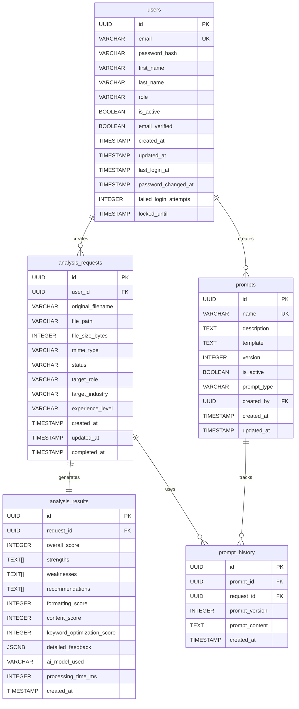

# Database ER Diagram - AI Resume Review Platform

## Entity Relationship Diagram

## Table Descriptions

### users
- **Purpose**: Store user authentication and profile information
- **Key Features**: 
  - UUID primary key for security
  - Role-based access (consultant, admin)
  - Email verification tracking
  - Soft delete via is_active flag
  - Password security tracking (failed attempts, lockout, change history)

### analysis_requests
- **Purpose**: Track resume analysis requests and metadata
- **Key Features**:
  - File metadata storage
  - Status tracking (pending → processing → completed/failed)
  - Target job context (role, industry, experience level)
  - Audit trail with timestamps

### analysis_results
- **Purpose**: Store AI-generated analysis and feedback
- **Key Features**:
  - Structured scoring system (0-100)
  - Flexible feedback storage with arrays and JSONB
  - Performance tracking (processing time, model used)
  - One-to-one relationship with requests

### prompts
- **Purpose**: Manage AI prompt templates and versions
- **Key Features**:
  - Versioned prompt templates
  - Type categorization (system, analysis, formatting, content)
  - Active/inactive status for A/B testing
  - User attribution for custom prompts

### prompt_history
- **Purpose**: Audit trail for prompt usage in analyses
- **Key Features**:
  - Links specific prompt versions to analysis requests
  - Enables reproducibility and debugging
  - Supports A/B testing analytics

## Relationships

1. **users → analysis_requests**: One-to-many (users can submit multiple requests)
2. **analysis_requests → analysis_results**: One-to-one (each request generates one result)
3. **users → prompts**: One-to-many (users can create custom prompts)
4. **prompts → prompt_history**: One-to-many (prompts track usage history)
5. **analysis_requests → prompt_history**: One-to-many (requests use multiple prompts)

## Security Considerations

- All tables use UUID primary keys to prevent enumeration attacks
- Password hashing is handled at the application layer
- Foreign key constraints ensure referential integrity
- Cascading deletes maintain data consistency
- Indexes optimize query performance

## Performance Optimizations

- Strategic indexing on frequently queried columns
- JSONB for flexible schema evolution
- Array types for efficient list storage
- Timestamp indexing for chronological queries